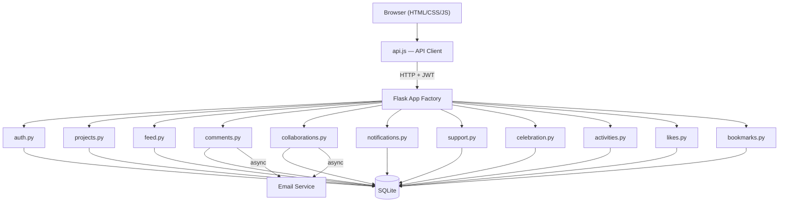
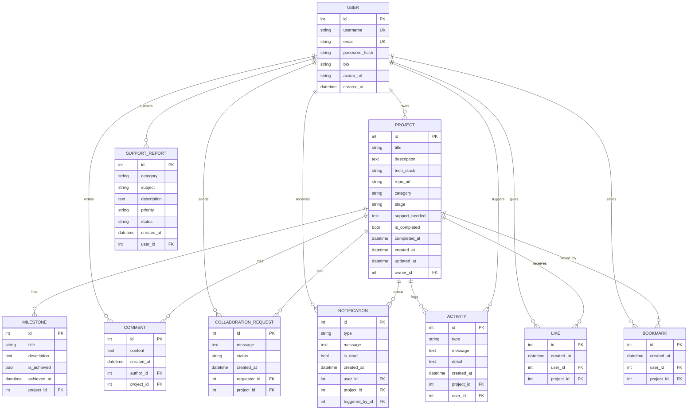

# MzansiBuilds — Design Document

## Overview
MzansiBuilds is a platform for South African developers to share, track, and celebrate their projects. Built for the Derivco Code Skills Challenge, it aims to be simple, robust, and easy to extend.

**Live:** https://mzansibuilds.pythonanywhere.com

---

## 1. Architecture
- **Frontend:** Single-page app (SPA) in vanilla HTML/CSS/JS
- **Backend:** Flask (Python 3.14), split into blueprints by domain
- **Database:** SQLite via SQLAlchemy ORM
- **Auth:** JWT (stateless, 24h expiry)
- **Deployment:** PythonAnywhere

### Architecture Diagram

### Database ER Diagram

---

## 2. Design Principles
- **SOLID**: All backend code is split by Single Responsibility (SRP) and Open/Closed (OCP) via blueprints. No fat controllers.
- **Minimalism**: No frontend frameworks, no unnecessary dependencies.
- **Extensibility**: Adding a new feature = add a new blueprint, model, and route. No rewrites needed.
- **Security**: Passwords hashed, JWT for auth, CORS enabled, file uploads sanitized, secret keys not hardcoded.

---

## 3. Data Model
- **User**: Auth, profile, avatar, bio
- **Project**: Title, description, tech stack, repo URL, category, stage, owner
- **Milestone**: Linked to project, tracks progress
- **Comment**: Linked to project and user
- **CollaborationRequest**: User requests to join a project
- **Notification**: In-app alerts for comments/collabs
- **SupportReport**: Bug/support tickets
- **Activity**: Timeline of project events

---

## 4. Key Features & Rationale
- **Live Feed**: Shows all projects, filterable by stage/category/search
- **Project CRUD**: Full create/edit/delete, with milestones and tech tags
- **Collaboration**: Request, accept, decline — all logged as activities
- **Notifications**: In-app, with optional email (async, off by default)
- **Celebration Wall**: Highlights completed projects
- **Support**: Users can submit bug reports
- **Dark/Light Mode**: CSS variables, toggled via JS
- **Pagination**: For feed and search
- **Public Profiles**: View any user's projects

---

## 5. Trade-offs & Decisions
- **SQLite**: Chosen for zero setup and reliability at this scale. Would swap for Postgres in production.
- **No React/Vue**: Simpler, faster to build, easier for judges to review. All logic in `app.js`.
- **Blueprint Split**: Improves maintainability and SOLID compliance, at the cost of more files.
- **Email**: Async via threading, but disabled by default to avoid spam/abuse.
- **Security**: No user roles (admin/moderator) — would add for a real launch.

---

## 6. What's Been Done
- **128 tests** (unit + integration) covering all routes, models, and workflows
- **CI/CD pipeline** via GitHub Actions — runs tests and linting on every push and PR
- **Ethical AI documentation** — see [AI_USAGE.md](AI_USAGE.md) for full disclosure of AI tool usage

## 7. What I'd Improve with More Time
- Switch to Postgres
- Add admin/moderator roles
- More granular permissions (edit/collab)
- Better error handling and logging
- More analytics (project views, user stats)
- Mobile-first responsive design

---

## 8. References
- [Flask Docs](https://flask.palletsprojects.com/)
- [SQLAlchemy Docs](https://docs.sqlalchemy.org/)
- [JWT Auth](https://flask-jwt-extended.readthedocs.io/)
- [PythonAnywhere](https://www.pythonanywhere.com/)
- [Mermaid Diagrams](https://mermaid-js.github.io/)

---

**Author:** Kaylash (MzansiBuilds)
