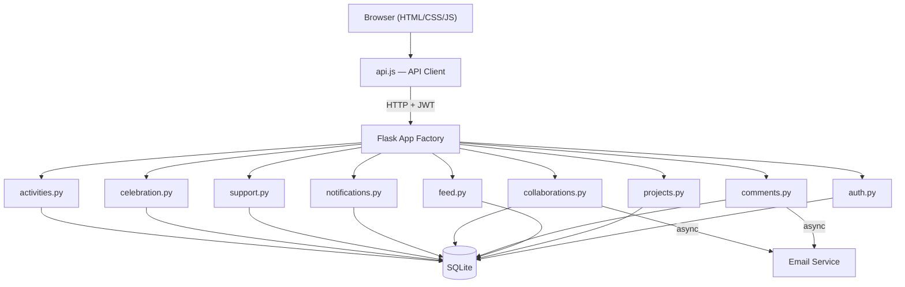
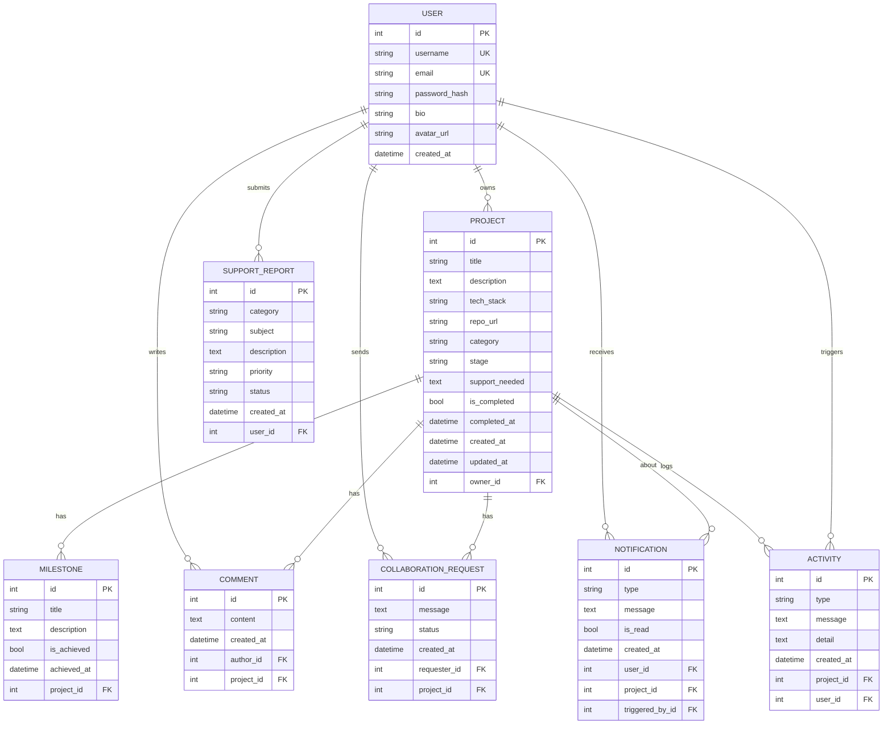

# MzansiBuilds

A platform where South African developers can share what they're building, find collaborators, and celebrate shipped projects together.

Built for the **Derivco Code Skills Challenge**.

**Live site:** https://mzansibuilds.pythonanywhere.com

## What it does

- Post your projects and track them through stages (Idea → In Progress → Testing → Launched)
- Browse a live feed of what other devs are working on
- Search and filter by tech stack, category, or project stage
- Request to collaborate on projects that interest you
- Comment and give feedback on other people's builds
- Celebrate launched projects on the Celebration Wall
- Get notified when someone comments or wants to collab
- Dark mode because obviously

## Tech stack

**Backend:** Python / Flask, SQLite, Flask-SQLAlchemy, Flask-JWT-Extended, Flask-CORS

**Frontend:** Vanilla HTML, CSS, JavaScript (no frameworks — just a single-page app with page toggling)

**Deployment:** PythonAnywhere

## Project structure

```
├── run.py                  # entry point
├── requirements.txt
├── server/
│   ├── app.py              # app factory, blueprint registration
│   ├── config.py           # configuration
│   ├── extensions.py       # db + jwt instances
│   ├── models.py           # all SQLAlchemy models
│   ├── email_service.py    # async email notifications
│   └── routes/
│       ├── auth.py         # register, login, profile, password reset
│       ├── projects.py     # CRUD projects + milestones
│       ├── feed.py         # live feed with search/filter/pagination
│       ├── comments.py     # project comments
│       ├── collaborations.py  # collab requests + responses
│       ├── notifications.py   # user notifications
│       ├── support.py      # bug reports / support tickets
│       ├── celebration.py  # celebration wall
│       └── activities.py   # project activity timeline
├── templates/
│   └── index.html          # the whole frontend lives here
├── static/
│   ├── css/style.css
│   └── js/
│       ├── api.js          # API client class
│       └── app.js          # all frontend logic
└── uploads/                # user avatars
```

## Running locally

```bash
pip install -r requirements.txt
python run.py
```

Server starts on http://localhost:5000. That's it — SQLite creates the database automatically on first run.

## Design decisions

- **Blueprints split by domain** — each route file handles one thing (comments, collabs, notifications, etc.) instead of stuffing everything into one file. Keeps it manageable and follows SRP.
- **No frontend framework** — the brief said HTML/CSS/JS, so that's what it is. One HTML file with sections that toggle visibility, plus a JS API client that talks to the backend.
- **JWT auth** — stateless, simple, works well for an API-driven SPA.
- **SQLite** — good enough for this scale, zero setup, just works.
- **CSS custom properties for theming** — dark mode toggles a `data-theme` attribute and all the colours swap via CSS variables.

## Features list

- User registration & login (JWT)
- Password reset flow
- Editable profiles with avatar upload
- Project CRUD with stage tracking
- Milestones per project
- Tech stack tags
- Project categories
- Live feed with search, filters, and pagination
- Comments on projects
- Collaboration requests (send, accept, decline)
- Notification system (in-app)
- Email notifications (optional, off by default)
- Activity timeline per project
- Celebration Wall for launched projects
- Support / bug report system
- Dark / light mode toggle
- Public user profiles
- Progress bars based on milestones

## Architecture



## Database ER Diagram



## Colours

Green, white, and black — South African inspired. The green is `#00a86b`.
