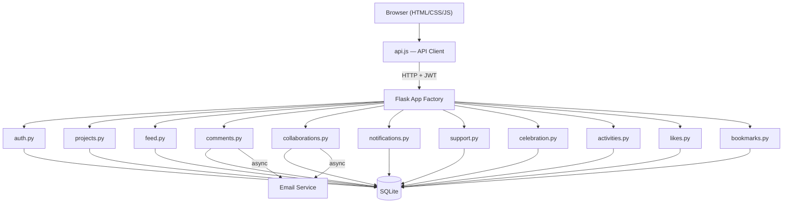
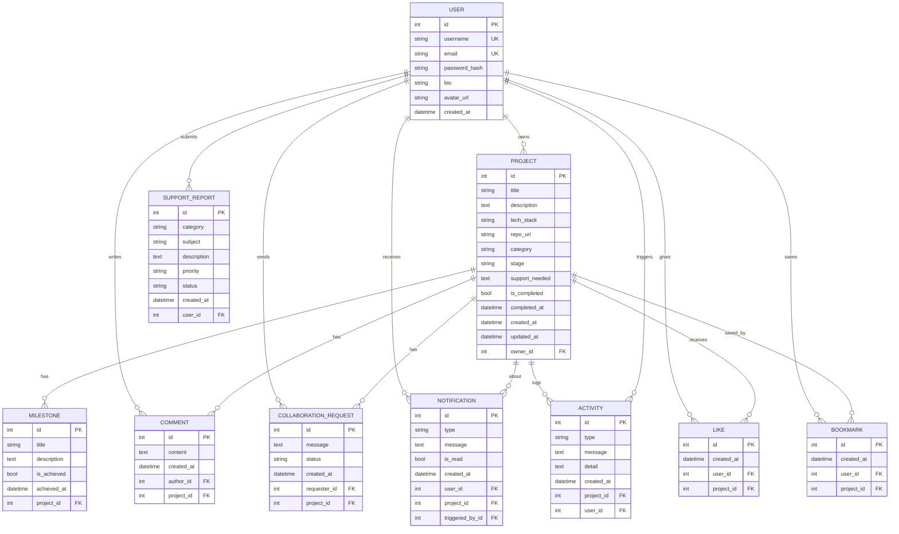

# MzansiBuilds


A platform where South African developers can share what they're building, find collaborators, and celebrate shipped projects together.

Built for the **Derivco Code Skills Challenge**.

**Live site:** https://mzansibuilds.pythonanywhere.com

## What it does

- Post your projects and track them through stages (Idea → In Progress → Testing → Launched)
- Browse a live feed of what other devs are working on
- Search and filter by tech stack, category, or project stage
- Request to collaborate on projects that interest you
- Comment and give feedback on other people's builds
- Like and endorse projects you appreciate
- Bookmark projects to revisit later
- Celebrate launched projects on the Celebration Wall
- Get notified when someone comments or wants to collab
- Dark mode because obviously

## Tech stack

**Backend:** Python / Flask, SQLite, Flask-SQLAlchemy, Flask-JWT-Extended, Flask-CORS

**Frontend:** Vanilla HTML, CSS, JavaScript (no frameworks — just a single-page app with page toggling)

**Deployment:** PythonAnywhere

## Project structure

```
├── run.py                  # entry point
├── requirements.txt
├── server/
│   ├── app.py              # app factory, blueprint registration
│   ├── config.py           # configuration
│   ├── extensions.py       # db + jwt instances
│   ├── models.py           # all SQLAlchemy models
│   ├── email_service.py    # async email notifications
│   └── routes/
│       ├── auth.py         # register, login, profile, password reset
│       ├── projects.py     # CRUD projects + milestones
│       ├── feed.py         # live feed with search/filter/pagination
│       ├── comments.py     # project comments
│       ├── collaborations.py  # collab requests + responses
│       ├── notifications.py   # user notifications
│       ├── support.py      # bug reports / support tickets
│       ├── celebration.py  # celebration wall
│       ├── activities.py   # project activity timeline
│       ├── likes.py        # like/unlike toggle
│       └── bookmarks.py    # save/unsave projects
├── templates/
│   └── index.html          # the whole frontend lives here
├── tests/
│   ├── conftest.py         # shared fixtures (in-memory DB, helpers)
│   ├── test_auth.py        # auth route tests
│   ├── test_projects.py    # project + milestone route tests
│   ├── test_features.py    # comments, collabs, feed, notifications, etc.
│   ├── test_models.py      # model unit tests
│   ├── test_integration.py # multi-step workflow tests
│   ├── test_likes.py       # like feature tests
│   └── test_bookmarks.py   # bookmark feature tests
├── static/
│   ├── css/style.css
│   └── js/
│       ├── api.js          # API client class
│       └── app.js          # all frontend logic
└── uploads/                # user avatars
```

## Running locally

```bash
pip install -r requirements.txt
python run.py
```

Server starts on http://localhost:5000. That's it — SQLite creates the database automatically on first run.

## Running tests

The project includes 128 tests covering all API routes, models, and features. Tests use an **in-memory SQLite database**, so your production data is never touched.

```bash
pip install pytest
python -m pytest tests/ -v
```

**What's tested:**

| File | What it covers | Tests |
|---|---|---|
| `tests/test_auth.py` | Registration, login, profile updates, password reset | 21 |
| `tests/test_projects.py` | Project CRUD, search, filtering, milestones | 21 |
| `tests/test_features.py` | Comments, collaborations, feed, notifications, support, celebration wall, activities | 29 |
| `tests/test_models.py` | All model `to_dict()` methods and relationships | 10 |
| `tests/test_integration.py` | Multi-step workflows (register → create → collab → comment) | 16 |
| `tests/test_likes.py` | Like toggle, multi-user likes, cascade delete, feed/celebration integration | 15 |
| `tests/test_bookmarks.py` | Bookmark toggle, status, saved list, cascade delete, multi-user isolation | 16 |

**Useful pytest flags:**

```bash
# Run a specific test file
python -m pytest tests/test_auth.py -v

# Run a specific test class
python -m pytest tests/test_auth.py::TestLogin -v

# Run a single test
python -m pytest tests/test_auth.py::TestLogin::test_login_success -v

# Stop on first failure
python -m pytest tests/ -x

# Show print output
python -m pytest tests/ -s
```

## Design decisions

- **Blueprints split by domain** — each route file handles one thing (comments, collabs, notifications, etc.) instead of stuffing everything into one file. Keeps it manageable and follows SRP.
- **No frontend framework** — the brief said HTML/CSS/JS, so that's what it is. One HTML file with sections that toggle visibility, plus a JS API client that talks to the backend.
- **JWT auth** — stateless, simple, works well for an API-driven SPA.
- **SQLite** — good enough for this scale, zero setup, just works.
- **CSS custom properties for theming** — dark mode toggles a `data-theme` attribute and all the colours swap via CSS variables.

## Security

| Area | Implementation |
|---|---|
| **Password hashing** | Werkzeug `generate_password_hash` / `check_password_hash` — passwords are never stored in plain text |
| **JWT authentication** | Stateless tokens with 24-hour expiry, secret keys generated via `secrets.token_hex(32)` |
| **Authorization checks** | Ownership verified on every edit/delete — projects, milestones, collaborations, notifications all check `owner_id` before allowing changes |
| **SQL injection** | SQLAlchemy ORM throughout, no raw SQL — all queries are parameterized |
| **XSS prevention** | `escapeHtml()` applied to every user-generated value rendered in the DOM (titles, descriptions, usernames, comments, URLs, tech tags) |
| **Input validation** | Email regex, username min 3 chars, password min 6 chars, comment max 2000 chars, stage whitelist, pagination capped at 50 |
| **File upload security** | Extension whitelist (png/jpg/jpeg/gif/webp), 2 MB size limit, `secure_filename()` + UUID rename to prevent path traversal |
| **Password reset** | 6-digit codes hashed with Werkzeug and expire after 15 minutes |
| **Error handling** | Generic login errors (`"Invalid email or password"`) — doesn't reveal which field is wrong |
| **Database constraints** | Unique constraints on likes/bookmarks, cascade deletes on project removal, foreign key enforcement |
| **CORS** | Flask-CORS enabled for cross-origin API access |
| **Secret management** | Keys read from environment variables with secure random fallbacks for local development |

## CI / CD

The project uses **GitHub Actions** for continuous integration. The pipeline is defined in `.github/workflows/ci.yml` and runs automatically on every push to `main` and on pull requests.

| Job | What it does |
|---|---|
| **test** | Installs dependencies and runs the full pytest suite against Python 3.11 and 3.12 |
| **lint** | Runs flake8 to catch syntax errors, undefined names, and style warnings |

This ensures that every change is validated before it reaches the main branch: tests must pass and critical lint errors must be resolved.

## Ethical Use of AI

See [AI_USAGE.md](AI_USAGE.md) for a full disclosure of how AI tools (GitHub Copilot, ChatGPT/Claude) were used during development, the safeguards applied, and the data privacy commitments made.

**Key principles:**
- AI was used for productivity (scaffolding, debugging), never as a decision-maker
- Every AI suggestion was manually reviewed, tested, and verified before committing
- No user data is sent to any AI service — the application has zero runtime AI integration
- All security-critical code was designed manually following established best practices

## Features list

- User registration & login (JWT)
- Password reset flow
- Editable profiles with avatar upload
- Project CRUD with stage tracking
- Milestones per project
- Tech stack tags
- Project categories
- Live feed with search, filters, and pagination
- Comments on projects
- Collaboration requests (send, accept, decline)
- Notification system (in-app)
- Email notifications (optional, off by default)
- Activity timeline per project
- Celebration Wall for launched projects
- Support / bug report system
- Like / endorse projects
- Bookmark / save projects for later
- Dark / light mode toggle
- Public user profiles
- Progress bars based on milestones

## Architecture



## Database ER Diagram



## Colours

Green, white, and black — South African inspired. The green is `#00a86b`.
